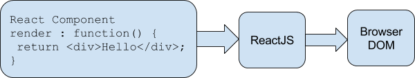
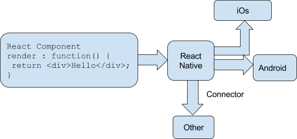
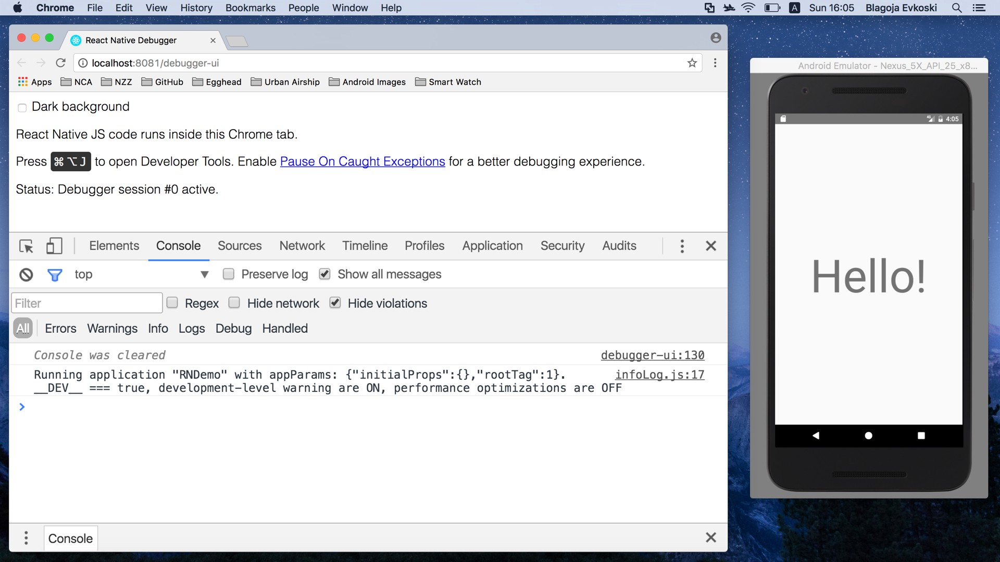

# React Native

## React

An abstraction layer (bridge) between what developer wants to display and what the engine underneath understands.

### Examples

`<View>` gets translated into `UIView` in iOS, and `android.view` on Android (and `
` on web)

`<Text>` gets translated into `UILabel` in iOS, and `android.text` on Android (and `
` on web)

## Component

    render() {
      return <MyAwesomeComponent />
    }

## Render function

Simple:

    render() {
      return <Text>Hello world!</Text>
    }

Dynamic:

    render() {
      return <Text>Hello {myVar}</Text>
    }

Shorthand syntax for simple (stateless function components):

    const MyComponent = () => <Text>Hello world!</Text>

React on web:

React Native:

 ## State and props

This is a React question. Components are building blocks for UI of your app (input field, checkbox, or bigger parts, such as menu, friend list, that nest smaller components). Each component can have some internal state, that is represented as an object. State can for example in case of an input field contain information of what string is currently entered:

    this.state = { value: 'Hello world!' }

or in case of a checkbox whether it is checked or not:

    this.state = { checked: true }

Only the component itself can see its state and only the component can modify its state through `setState` method. State can be accessed through `this.state.foo` property.

Props on the other hand are parameters that are passed to the component from its parent component and are accessed through `this.props.foo`. The component cannot modify the props it is given.
The thing they have in common is that the component re-renders whenever state or props change, unless the behavior is modified in shouldComponentUpdate method

More read with practical examples: http://lucybain.com/blog/2016/react-state-vs-pros/

## Debugging & Live reload

    Cmd + D -> Debug JS Remotely

    Cmd + D -> Enable live reload

## Links

ReactNative: https://facebook.github.io/react-native/

Docs: https://facebook.github.io/react-native/docs/getting-started.html

How does it work: http://www.discoversdk.com/blog/how-react-native-works
